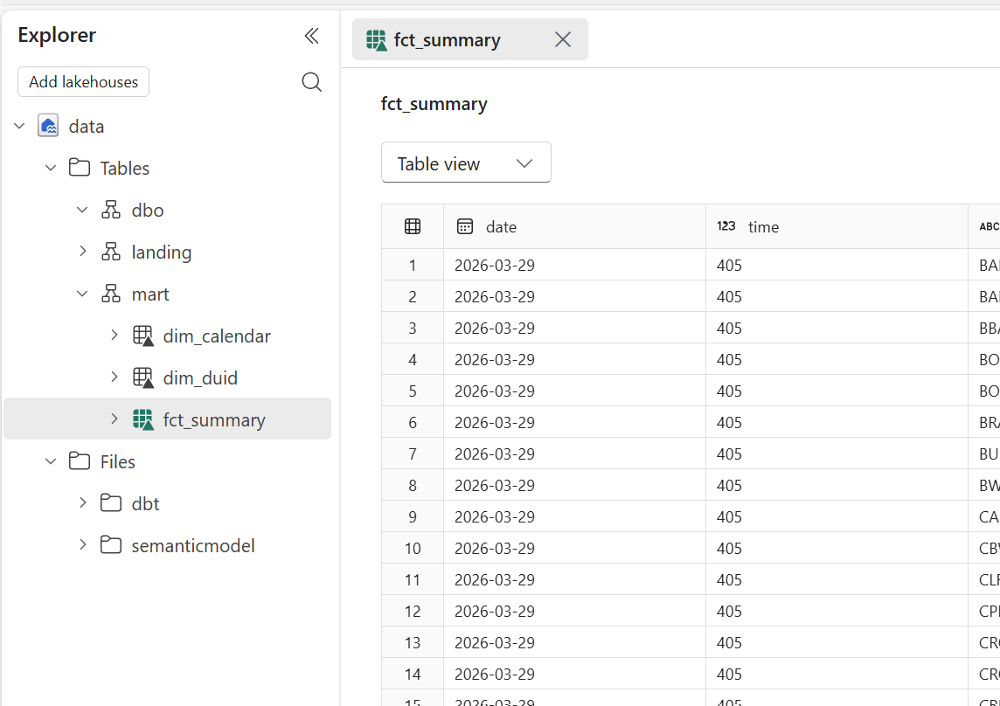
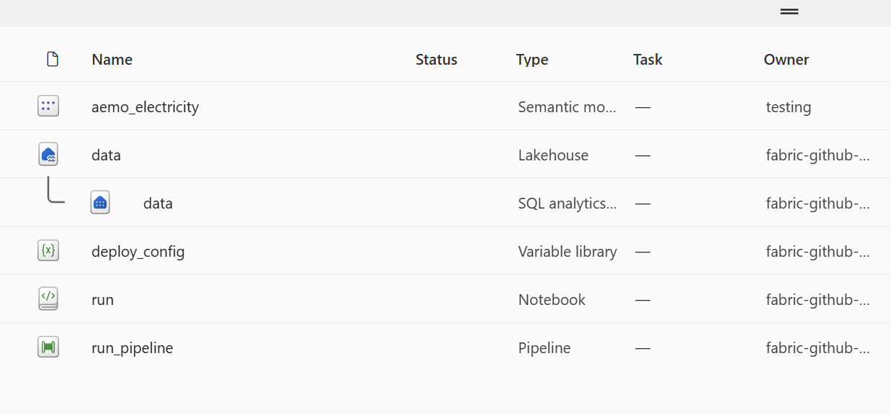

# dbt + DuckDB + OneLake Delta

The whole pipeline runs anywhere Python runs — your laptop, a GitHub Actions runner, a
container, an AI agent. Transformations are written as dbt models; [**duckrun**](https://github.com/djouallah/duckrun)
is the dbt adapter that executes them with DuckDB and materializes the results as
**Delta Lake** tables directly in OneLake (via delta-rs) — no Spark, no Iceberg, no
async virtualization. Delta is read natively by Power BI Direct Lake.

> **DuckDB executes · delta-rs materializes · dbt orchestrates.**



Concretely, for OneLake:
- `ONELAKE_TABLES_PATH` = `abfss://{workspace_id}@onelake.dfs.fabric.microsoft.com/{lakehouse_id}/Tables`
- `FILES_PATH` = `abfss://{workspace_id}@onelake.dfs.fabric.microsoft.com/{lakehouse_id}/Files`
- `TOKEN` = bearer token from `notebookutils.credentials.getToken('storage')` (in Fabric) or `az login --scope https://storage.azure.com/.default` (locally — `AzureCliCredential` picks it up automatically, no secrets to manage)

Use the IDs, not the names. `deploy.py` holds the workspace GUID in its `WORKSPACE`
constant and resolves the lakehouse GUID at deploy time via
`duckrun.workspace(...).create_lakehouse(LAKEHOUSE)`. Inside Fabric the notebook resolves
the lakehouse GUID via `notebookutils.lakehouse.get(lakehouse_name).id`; outside Fabric it
resolves it by name with `duckrun.workspace(workspace_id).lakehouse_id(lakehouse_name)`.

You can run the notebook anywhere — laptop, GitHub, Colab — but running inside Fabric
gives you in-region latency, no egress, a scheduler, and automatic token handling.


## dbt duckrun configuration

In `profiles.yml`, all targets use the `duckrun` adapter pointed at the OneLake
`Tables/` path:

```yaml
aemo_electricity:
  target: dev
  outputs:
    dev:
      type: duckrun
      schema: "{{ env_var('DBT_SCHEMA', 'mart') }}"
      root_path: "{{ env_var('ONELAKE_TABLES_PATH') }}"
```

The adapter auto-creates a matching DuckDB Azure secret from the bearer token, enabling
`delta_scan()` reads. Models persist to `<root_path>/<schema>/<model>` as Delta tables.

### Incremental strategies

The pipeline is **file-level incremental** — each fact model reads only files it
hasn't loaded yet and inserts them idempotently, keyed on the filename:

| Strategy | Behavior | Used by |
|----------|----------|---------|
| `insert` | Insert only new keys (idempotent) | fact models (keyed on `file`), `stg_csv_archive_log` |
| `insert` + overwrite | Intraday: insert new `(date,time,DUID)` rows (dup-safe, never updates); **overwrite** the whole table when a new **daily** file lands. The overwrite is decided by the **runner**, not the model — `full_refresh` is fixed at parse time, so both runners call the `check_new_daily` run-operation and only then rerun with `--full-refresh` | `fct_summary` |
| `insert` (date-keyed) | Project a landing table into `mart`, skipping dates already present | `fct_region`, `fct_unit_dispatch`, `fct_interconnector_derived` |
| `merge` | Upsert — update matched, insert new | `dim_duid` (attributes change; key `DUID`) |
| `append` (one-off) | Built once; later runs select nothing (`WHERE 1=0`) → no-op | `dim_calendar` (fixed, generated) |

```sql
{{ config(materialized='incremental', incremental_strategy='insert', unique_key='file') }}
```

## Schema layout

- **`landing`** — staging and incremental fact tables (source ingestion, deduplication):
  `fct_scada` (AEMO `DUNIT`, all 49 columns), `fct_price` (AEMO `DREGION`, all 126 columns —
  demand and net interchange live here, not just price), `fct_scada_today`, `fct_price_today`,
  `fct_interconnector_today`, `fct_constraint_today`
- **`mart`** — Power BI-facing models (joined, ready for Direct Lake): `dim_*`, `fct_summary`
  (unit MW + price, with the live intraday tail), `fct_region` (demand, net interchange,
  available generation), `fct_unit_dispatch` (offered vs dispatched, ramp rates, FCAS),
  `fct_interconnector` + `fct_interconnector_derived` (per-link flows; derived covers full
  history), `fct_constraint` (limits that actually bound)

---

## Manual deploy from laptop

```bash
az login
python deploy.py
```

All you need:
- [Azure CLI](https://learn.microsoft.com/cli/azure/install-azure-cli) — `az login` uses your own identity, whatever access you have in Fabric is what the deploy gets
- `pip install duckrun` — the deploy runs entirely through its workspace API

No service principal, no app registration, no secrets — that whole song-and-dance is only for the CI path below.

## Optional: automated deployment to Fabric

Everything below is opt-in. The core dbt + DuckDB + OneLake loop runs without any of it.
This section covers using the included `deploy.py` + GitHub Actions to provision a
Lakehouse, push the notebook, run dbt on a schedule, and refresh a Power BI semantic model.

### Architecture

```
GitHub Push
    │
    ▼
GitHub Actions CI
    ├── dbt run   (DuckDB + duckrun → OneLake Delta, test workspace)
    └── dbt test  (validates Delta table row counts)
    │
    ▼
deploy.py (duckrun workspace API)
    ├── create_lakehouse → Lakehouse (schemas, in the `aemo` folder)
    ├── connect().copy() → dbt/ to OneLake Files
    ├── deploy("fabric_items") → the whole folder, in dependency order:
    │   ├── Variable Library (env values injected at deploy time)
    │   ├── Notebook
    │   └── Data Pipeline (notebook activities auto-wired) + schedule
    ├── deploy("semantic_model") → Semantic Model (Direct Lake GUIDs repointed,
    │       then refreshed) — skipped when DEPLOY_SEMANTIC_MODEL=false
    └── ontology.py → Ontology + Graph, then data_agent.py → Data Agent
```

The semantic model sits in its own folder so it can be skipped: duckrun's `deploy()` has no
exclude filter, so a single `fabric_items/` call would be all-or-nothing. Nothing downstream
binds to the model — the ontology and data agent read the mart Delta tables — and skipping it
also skips the Direct Lake reframe, which is the slow part of a deploy.



### Stack

| Layer | Tool |
|-------|------|
| Transformations | dbt-core + duckrun (dbt-duckdb adapter) |
| Table format | Delta Lake (delta-rs / `deltalake`) |
| Execution | Python notebook (Fabric) |
| Storage | OneLake (Delta / Parquet) |
| Serving | Direct Lake semantic model (Power BI) |
| CI | GitHub Actions |
| Deploy | duckrun workspace API (`ws.deploy`) |

### Environments

| Target | Warehouse | Token source | Use case |
|--------|-----------|--------------|----------|
| `dev` | Test workspace on OneLake | `az login` (AzureCliCredential) | Local development |
| `ci` | Test workspace on OneLake | OIDC federated credential (no stored secret) | GitHub Actions |
| `prod` | Prod workspace on OneLake | notebookutils | Fabric notebook |

### Configuration files

- `deploy.py` — workspace/lakehouse IDs, workspace folder, schedule and limits, as constants
- `profiles.yml` — dbt targets with the duckrun adapter config
- `dbt_project.yml` — model config and variable defaults

### CI/CD setup (GitHub Actions)

Auth is **OIDC** — no long-lived bearer tokens stored in GitHub, and no `azure/login` or
token-minting step at all. duckrun exchanges GitHub's short-lived OIDC assertion for every
token it needs (OneLake storage, the Fabric control plane, Power BI) at the moment it needs
it. The workflow just grants `id-token: write` and passes the client/tenant id through.

The only GitHub secrets you need:
- `AZURE_CLIENT_ID` — your Azure AD app registration
- `AZURE_TENANT_ID` — your tenant

On the Azure side, register an app and add a **federated credential** with subject
`repo:<owner>/<repo>:ref:refs/heads/main` (and one per deploy branch). Grant it the Fabric
workspace permissions you need.

The workflow is **manual only** — run it from the Actions tab or `gh workflow run
pipeline.yml`. Every run provisions the lakehouse, runs dbt (run / test / docs) and publishes
the docs to GitHub Pages; deploying the Fabric items is a separate opt-in choice:

| `deploy` | What it deploys |
|---|---|
| `none` (default) | Nothing — dbt only |
| `no_model` | Variable library, notebook, pipeline, ontology and data agent — **not** the semantic model. The already-deployed model is left in place, just not updated or refreshed |
| `full` | All of the above **plus** the Direct Lake semantic model |

`no_model` is the fast loop for ontology work: the Direct Lake reframe is the slow part of a
deploy, and nothing in the ontology or data agent binds to the model.

---

## Learnings

- **Emit `timestamptz`, not `timestamp`.** Naive `TIMESTAMP` maps to Delta `timestamp_ntz`,
  which Microsoft docs flag as "not fully supported across Fabric workloads."
  `CAST(... AS TIMESTAMPTZ)` at output columns.
- **Insert by filename.** Facts are loaded one file at a time and never reprocessed, so
  `incremental_strategy='insert'` keyed on `file` is the right idempotent fit — not a
  grain-level `merge`. Reserve `merge` for dimensions whose attributes actually change
  (`dim_duid`), and a plain `table` for fixed generated ones (`dim_calendar`).
- **Delta maintenance is on you.** Compaction (`OPTIMIZE`) and `VACUUM` via delta-rs.
